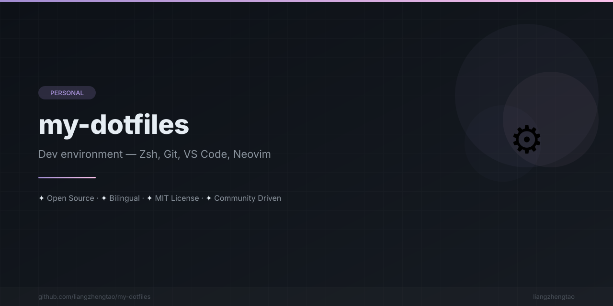

[English](README.md) | [中文](README.zh.md) | [日本語](README.ja.md) | [Français](README.fr.md) | [Español](README.es.md) | [العربية](README.ar.md) | [한국어](README.ko.md) | [Português](README.pt.md) | [Русский](README.ru.md) | [Deutsch](README.de.md)

<div align="center">



</div>


# Mis Dotfiles

**Mis configuraciones de entorno de desarrollo. Zsh, Git, VS Code, Neovim, Tmux — todo lo necesario para ser productivo.**

---

## Contenido

| Config | Archivo | Descripción |
|--------|------|-------------|
| Zsh | [configs/zshrc.md](configs/zshrc.md) | Configuración de Shell con oh-my-zsh, plugins, alias y prompt |
| Git | [configs/gitconfig.md](configs/gitconfig.md) | Alias de Git, firma, herramientas de diff y asistentes de flujo de trabajo |
| VS Code | [configs/vscode-settings.md](configs/vscode-settings.md) | Configuración, extensiones, atajos de teclado y fragmentos de código |
| Neovim | [configs/neovim.md](configs/neovim.md) | Configuración completa de Neovim con LazyVim, LSP y plugins |
| Tmux | [configs/tmux.md](configs/tmux.md) | Configuración del multiplexor de terminal con plugins y barra de estado |

## Inicio rápido

```bash
# Clonar el repositorio
git clone https://github.com/liangzhengtao/my-dotfiles.git ~/my-dotfiles
cd ~/my-dotfiles

# Respaldar configuraciones existentes (¡siempre respaldar primero!)
mkdir -p ~/dotfiles-backup/$(date +%Y%m%d)
cp ~/.zshrc ~/dotfiles-backup/$(date +%Y%m%d)/ 2>/dev/null || true
cp ~/.gitconfig ~/dotfiles-backup/$(date +%Y%m%d)/ 2>/dev/null || true
cp ~/.tmux.conf ~/dotfiles-backup/$(date +%Y%m%d)/ 2>/dev/null || true

# Aplicar configuraciones (consulta cada guía para los pasos específicos)
# Cada archivo de configuración (.md) contiene el contenido real y las instrucciones
```

> **Nota:** Cada archivo de configuración (`.md`) contiene el contenido de configuración junto con las instrucciones de instalación y explicaciones. Copia las secciones relevantes en tus archivos de configuración.

## Instalación por herramienta

### Zsh

```bash
# Instalar oh-my-zsh
sh -c "$(curl -fsSL https://raw.githubusercontent.com/ohmyzsh/ohmyzsh/master/tools/install.sh)"

# Consulta configs/zshrc.md para el contenido completo de .zshrc
```

### Tmux

```bash
# Instalar TPM (Tmux Plugin Manager)
git clone https://github.com/tmux-plugins/tpm ~/.tmux/plugins/tpm

# Consulta configs/tmux.md para el contenido completo de .tmux.conf
```

### Neovim

```bash
# Instalar Neovim (macOS)
brew install neovim

# Consulta configs/neovim.md para la configuración inicial de LazyVim
```

### Git

```bash
# Consulta configs/gitconfig.md para el contenido completo de .gitconfig
# Copia las secciones relevantes en ~/.gitconfig
```

### VS Code

```bash
# Consulta configs/vscode-settings.md para configuración, extensiones y atajos
# Las extensiones se pueden instalar mediante CLI:
# code --install-extension <extension-id>
```

## Estructura del proyecto

```
my-dotfiles/
├── configs/
│   ├── zshrc.md              # Configuración de Zsh
│   ├── gitconfig.md          # Configuración de Git
│   ├── vscode-settings.md    # Configuración y extensiones de VS Code
│   ├── neovim.md             # Neovim + LazyVim
│   └── tmux.md              # Configuración de Tmux
├── README.md
├── README.zh.md
├── CONTRIBUTING.md
├── SECURITY.md
├── CODE_OF_CONDUCT.md
├── CHANGELOG.md
├── LICENSE
└── .gitignore
```

## Ver también

- [dotfiles.github.io](https://dotfiles.github.io/) — Directorio comunitario de dotfiles
- [awesome-dotfiles](https://github.com/webpro/awesome-dotfiles) — Recursos de Dotfiles
- [oh-my-zsh](https://github.com/ohmyzsh/ohmyzsh) — Framework de Zsh
- [LazyVim](https://github.com/LazyVim/LazyVim) — Framework de configuración para Neovim
- [tmux-plugin-manager](https://github.com/tmux-plugins/tpm) — Gestor de plugins de Tmux

## Licencia

Este proyecto está licenciado bajo la Licencia MIT — consulta el archivo [LICENSE](LICENSE) para más detalles.

## Contribuir

¡Las contribuciones son bienvenidas! Lee la [Guía de Contribución](CONTRIBUTING.md) antes de enviar un pull request.
